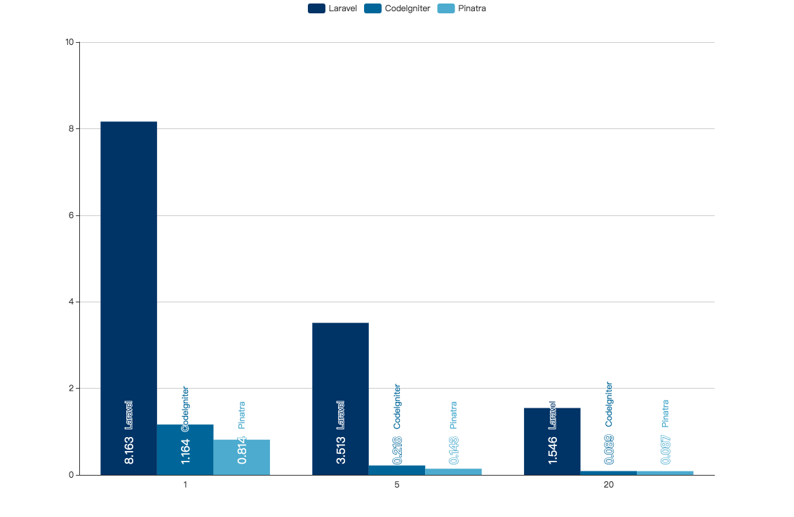
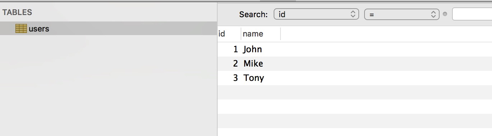
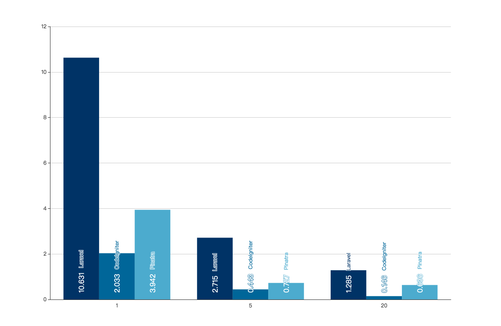

# Benchmark

## Environment

| Name | Value |
| :-------------: | :-----:|
| Operating System | CentOS Linux release 7.5.1804 |
| Linux Kernel | 3.10.0-862.11.6.el7.x86_64 |
| CPU | ( 6-Core Intel Xeon X5650 2.66GHz ) x 2 = 12 Cores, 24 Threads |
| Memory | ( DDR3 1333MHz 4GB ) x 12 = 48GB |
| Disk | SSD 6.15/111.79 GiB (5.5%) |
| Test Software | ApacheBench, Version 2.3 with mod_php72w |
| Operating Environment | Apache/2.4.6 |
| Database | MariaDB 10.3.9 x86_64 |
| PHP Version | PHP 7.2.8 <br> Zend Engine v3.2.0 <br> Zend OPcache v7.2.8 |
| PHP plugin | bz2 calendar Core ctype curl date dom exif fileinfo filter <br> ftp gd gettext gmp hash iconv igbinary json libxml mbstring <br> mysqli openssl pcntl pcre PDO pdo_mysql pdo_sqlite Phar <br> posix readline redis Reflection session shmop SimpleXML SPL <br> sockets sqlite3 standard sysvmsg sysvsem sysvshm tokenizer <br> wddx xml xmlreader xmlwriter xsl Zend OPcache zip zlib Zend <br> OPcache |

## Testing framework and version

1. Laravel 5.7.2
2. Pinatra 0.0.2
3. CodeIgniter 3.1.9

## Testing process

Test using the ab tool that comes with httpd. The test points are as follows:

1. All sites are placed in subdirectory under the Apache default Document Root (/var/www/html) with a URL of 127.0.0.1/* and no changes to the Apache configuration file.
2. Each test completes 5000 requests, and sends 1, 5, and 20 each time. The minimum value of `Time per request: *[ms] (mean, across all concurrent requests)` is the result of the concurrent
3. Each test ensures that the memory is not full to ensure fairness.
4. The ab command and MariaDB both run on this server.
5. Only compare requests time-consuming, do not compare memory usage.


## Hello World

::: warning Definition
Hello World test: The normal flow of using a framework, in addition to "do not call the model" (do not connect to the database), use the normal Controller -> View process, print out the test of "Hello World!" several strings.
:::

### Test Results

The average time spent per request, in milliseconds (ms).

| Concurrent Numbers | Laravel | CodeIgniter | Pinatra |
| :-------------: | :-----: | :-----: | :-----: |
| 1 | 8.163 | 1.164 | 0.814 |
| 5 | 3.513 | 0.218 | 0.143 |
| 20 | 1.546 | 0.089 | 0.087 |

<br>



## Simple api test

In order to test the performance of the framework and minimize the impact of the database on performance, we installed MariaDB 10.3.9 and added the users table in the test library. There are three rows of data:



::: warning Definition
Simple api test: Using the normal flow of a framework, complete the entire process of Controller -> Model -> View, where CodeIgniter and Laravel use their own ORM, Pinatra uses Laravel's ORM component [illuminate/database] (https://packagist. Org/packages/illuminate/database).
:::

### Test Results

#### Test code

Laravel:


```php
# app/User.php
<?php

namespace App;

use Illuminate\Database\Eloquent\Model;

class User extends Model
{
    //
}

# app/Http/Controllers/HomeController.php
<?php

namespace App\Http\Controllers;

use Illuminate\Http\Request;

class HomeController extends Controller
{
  public function home() {
    return json_encode(\App\User::all()->toArray());
  }
}
```

CodeIgniter：

```php
# application/models/User.php
<?php if ( ! defined('BASEPATH')) exit('No direct script access allowed');

class User extends CI_Model {

    function __construct()
    {
        parent::__construct();
        $this->load->database();
    }
    public function getAll()
    {
        $query = $this->db->query('SELECT * FROM users');
        return $query->result_array();
    }
}

# application/controllers/Welcome.php
<?php
defined('BASEPATH') OR exit('No direct script access allowed');

class Welcome extends CI_Controller {
    public function index()
    {
        $this->load->model('user');
        echo json_encode($this->user->getAll());
    }
}
```

Pinatra：

```php
# model/User.php
<?php

namespace Model;

class Article extends \Pinatra\Model\Model
{
}

# controllers/HomeController.php
<?php

namespace Controllers;

class HomeController
{
  public function home()
  {
    return json_encode(\Model\User::all()->toArray());;
  }
}
```

#### Expected Output

```json
[{"id":1,"name":"John"},{"id":2,"name":"Mike"},{"id":3,"name":"Tony"}]
```


The average time spent per request, in milliseconds (ms).

| Concurrents | Laravel | CodeIgniter | Pinatra |
| :-------------: | :-----: | :-----: | :-----: |
| 1  | 10.631 | 2.033 | 3.942 |
| 5  | 2.715  | 0.443 | 0.727 |
| 20 | 1.285  | 0.146 | 0.636 |

<br>


