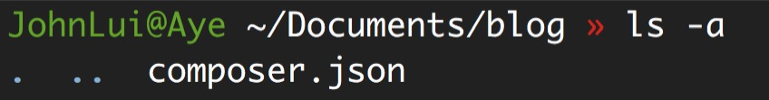
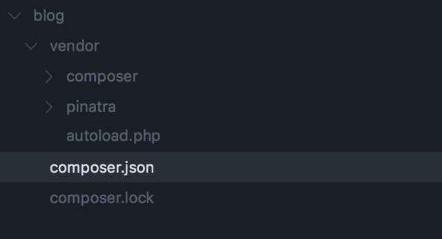
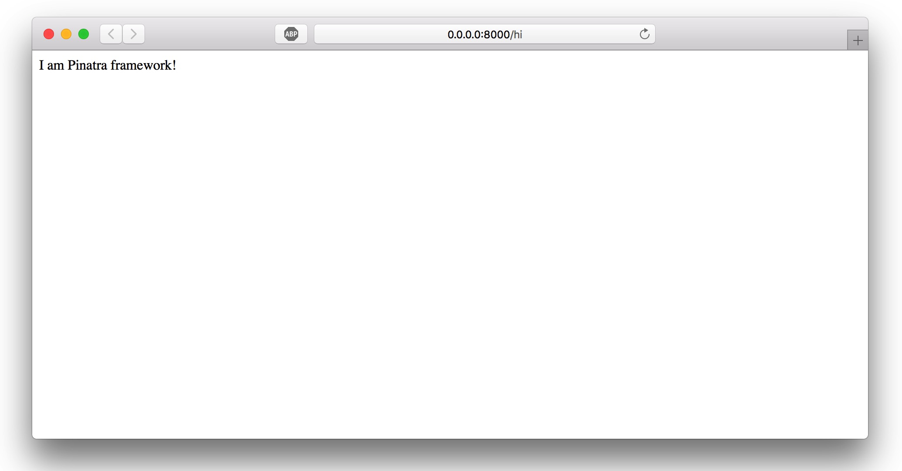

# Installation

## Environment require

* PHP > 7.0
* Composer

### Composer

Composer is the most popular PHP package manager, and there are plenty of open source software in the community for you to choose from.

## Details

Pinatra is the first PHP framework to do true hands-off, which itself is only available as an library, but provides sophisticated routing capabilities and a detailed MVC architecture.

Here is the "Step by Step" tutorial:

### Make a new project folder

```bash
mkdir blog
```

### composer initialization

```bash
cd blog
composer self-update
composer init
```

Then press Enter until `Search for a package`, type `pinatra/framework` and press Enter. When you get `version of the constraint to require (or leave blank to use the latest version)`, type `dev-master`, then continue press Enter all the way until the end of the interaction.

At this point, executing `ls -a` appears as shown below:



### View composer.json

Now the content of composer.json should be as follows:

```json
{
    "name": "user/blog",
    "require": {
        "pinatra/framework": "dev-master"
    },
    "authors": [
        {
            "name": "JohnLui",
            "email": "user@gmail.com"
        }
    ]
}
```

### Download all composer packages

Excuting shell command:

```bash
composer update
```

At this point you should get the vendor folder and expand it as shown below:



### Create index.php

This project's document root folder should be at the same level as the vendor, which is a security requirement. Create a new public folder:

```bash
mkdir public
cd public
```

Create a new index.php file:

```bash
touch index.php
```

Then fill it up with the following code:

```bash
<?php

require __DIR__.'/../vendor/autoload.php';

get('hi', function() {
  echo "I am Pinatra framework!";
});
```

### Use the single-threaded built-in web server of PHP to get our website live!

Make sure that the current path of the command line is under the public folder, and then run the following command:

```bash
php -S 0.0.0.0:8000
```

### View results

Visit `http://0.0.0.0:8000/hi`, if your results are as shown below, you are successful!

