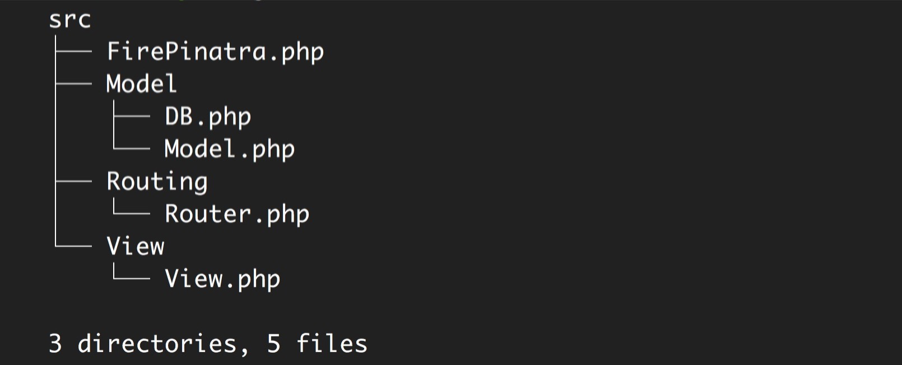
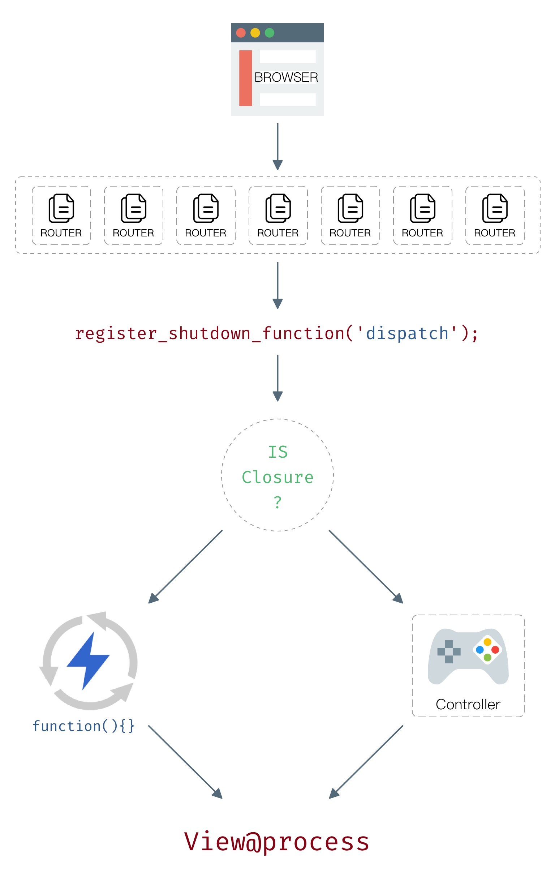

# Kernel details
Standing on Composer's shoulder, the 0.0.2 version of Pinatra has only 5 PHP files.

## Request processing flow

## key point

* Use `register_shutdown_function('dispatch')` to implement hands-off
* The core of the framework is routing, routing code must be tempered (don't worry, they have been tested with 100% coverage)
* Without the introduction of the template engine, the implementation of View is also very simple
* Thanks to Laravel for providing an extremely powerful ORM
* Composer and the open source community give Pinatra endless possibilities, and Pinatra only needs to do as little as possible to invade user intent.

## // Todo

The 0.0.2 version of Pinatra has a lot of deficiencies. The following is a list of features that have been planned for development. Please let me know what features you want to add.

Log function
2. debug switch
3. Unify the error page (eg 404, 500)

## Help Pinatra being better

Welcome to Pinatra for an issue: [https://github.com/Pinatra/Pinatra/issues/new](https://github.com/Pinatra/Pinatra/issues/new)