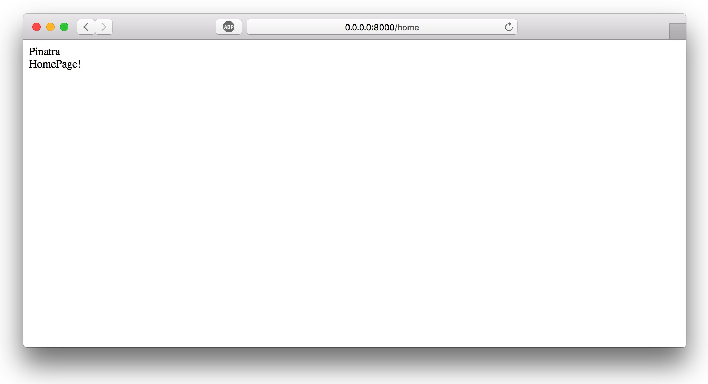

# Views

Views are a low-cost component of Pinatra with almost no performance penalty, using PHP itself as a template engine.

## Preparation

Before using the view component, we need to create a new folder as the root of the view files and define a constant to pass this information.

### New folder

Create a new folder `views` as the same level as `public`.

### Tell Pinatra

Add the following line of code to `public/index.php`:

```php
Define('VIEW_BASE_PATH', dirname(dirname(__FILE__)).'/views/');
```

## Creating a view file

Create a `views/home.php` file with the following code:

```php
<?php
echo $title.'<br>';
echo $home_page;
```

## Calling a view and passing in parameters

Whether in a closure or in a controller method, you can simply call the view with the following statement:

```php
get('/', function() {
  return view('home')->withTitle('Pinatra')
                     ->withHomePage('HomePage!');
});
```

```php
class HomeController
{
  public function home()
  {
    return view('home')->withTitle('Pinatra')
                       ->withHomePage('HomePage!');
  }
}
```

Visit the right URL and you will get the following page:



::: tip Tips
view() receives a string as a file path that supports the use of multi-level subfolders, separated by `/` or `.`, such as `admin/home` or `admin.home`.
:::

## Way of passing parameters

### with()

```php
view('home')->with('title', 'Piantra'); // $title == 'Pinatra'
```

### All functions starting with with

```php
view('home')->withTitle('Piantra'); // $title == 'Pinatra'
view('home')->withtitle('Piantra'); // $title == 'Pinatra'
view('home')->withHomePage('Piantra'); // $home_page == 'Pinatra'
```

> withSomeThing() will be translated from camelCase to snake_case when injected into a view.

### Return

The call to the view must use the `return view()` statement.