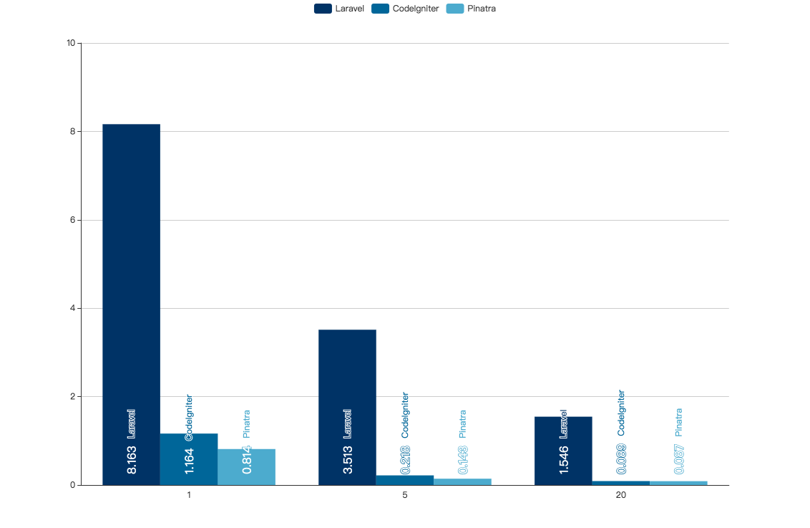
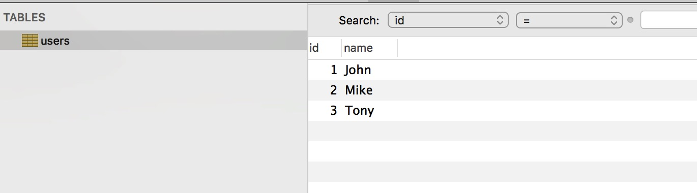

# 性能测试

## 测试环境

| 名称           | 值    |
| :-------------: | :-----:|
| 操作系统      | CentOS Linux release 7.5.1804 |
| Linux Kernel |   3.10.0-862.11.6.el7.x86_64 |
| CPU |   ( 6-Core Intel Xeon X5650 2.66GHz ) x 2 = 12 Cores, 24 Threads |
| 内存 | ( DDR3 1333MHz 4GB ) x 12 = 48GB |
| 磁盘 | SSD 6.15/111.79 GiB (5.5%) |
| 测试软件 | ApacheBench, Version 2.3 with mod_php72w |
| 运行环境 | Apache/2.4.6 |
| 数据库 | MariaDB 10.3.9 x86_64 |
| PHP 版本 | PHP 7.2.8 <br> Zend Engine v3.2.0 <br> Zend OPcache v7.2.8 |
| PHP 插件 | bz2 calendar Core ctype curl date dom exif fileinfo filter <br> ftp gd gettext gmp hash iconv igbinary json libxml mbstring <br> mysqli openssl pcntl pcre PDO pdo_mysql pdo_sqlite Phar <br> posix readline redis Reflection session shmop SimpleXML SPL <br> sockets sqlite3 standard sysvmsg sysvsem sysvshm tokenizer <br> wddx xml xmlreader xmlwriter xsl Zend OPcache zip zlib Zend <br> OPcache |

## 测试框架及版本

1. Laravel 5.7.2
2. Pinatra 0.0.2
3. CodeIgniter 3.1.9

## 测试流程

使用 httpd 自带的 ab 工具进行测试，测试要点如下：

1. 所有站点以子目录形式放置在 Apache 默认 Document Root（/var/www/html） 下，URL 均为 127.0.0.1/* ，Apache 配置文件无任何修改。
2. 每次测试完成 5000 个请求，并发 1、5、20 各进行 2 次，取`Time per request: *[ms] (mean, across all concurrent requests)`的最小值为该并发下的成绩
3. 每次测试都保证内存没有占满，以保证公平。
4. ab 命令和 MariaDB 都运行在这台服务器上。
5. 只对比请求耗时，不对比内存占用。

## Hello World

::: warning 定义
Hello World 测试：使用一个框架的正常流程，除了“不调用 Model”（不连接数据库）之外，使用正常的 Controller -> View 流程，打印出 “Hello World！”几个字符串的测试。
:::

### 测试结果

平均每次请求消耗的时间，单位为毫秒(ms)。

| 并发数 | Laravel | CodeIgniter | Pinatra |
| :-------------: | :-----: | :-----: | :-----: |
| 1  | 8.163 | 1.164 | 0.814 |
| 5  | 3.513  | 0.218 | 0.143 |
| 20 | 1.546  | 0.089 | 0.087 |

<br>



## 简单 api 测试

为了测试框架性能，尽量减少数据库对性能的影响，我们新安装 MariaDB 10.3.9，在 test 库中新增 users 表，一共有三行数据：



::: warning 定义
简单 api 测试：使用一个框架的正常流程，完成 Controller -> Model -> View 整个过程，其中 CodeIgniter 和 Laravel 使用自带的 ORM，Pinatra 使用 Laravel 的 ORM 组件 [illuminate/database](https://packagist.org/packages/illuminate/database)。
:::

### 测试结果

#### 测试代码

Laravel：

```php
# app/User.php
<?php

namespace App;

use Illuminate\Database\Eloquent\Model;

class User extends Model
{
    //
}

# app/Http/Controllers/HomeController.php
<?php

namespace App\Http\Controllers;

use Illuminate\Http\Request;

class HomeController extends Controller
{
  public function home() {
    return json_encode(\App\User::all()->toArray());
  }
}
```

CodeIgniter：

```php
# application/models/User.php
<?php if ( ! defined('BASEPATH')) exit('No direct script access allowed');

class User extends CI_Model {

    function __construct()
    {
        parent::__construct();
        $this->load->database();
    }
    public function getAll()
    {
        $query = $this->db->query('SELECT * FROM users');
        return $query->result_array();
    }
}

# application/controllers/Welcome.php
<?php
defined('BASEPATH') OR exit('No direct script access allowed');

class Welcome extends CI_Controller {
    public function index()
    {
        $this->load->model('user');
        echo json_encode($this->user->getAll());
    }
}
```

Pinatra：

```php
# model/User.php
<?php

namespace Model;

class Article extends \Pinatra\Model\Model
{
}

# controllers/HomeController.php
<?php

namespace Controllers;

class HomeController
{
  public function home()
  {
    return json_encode(\Model\User::all()->toArray());;
  }
}
```

#### 预期结果

```json
[{"id":1,"name":"John"},{"id":2,"name":"Mike"},{"id":3,"name":"Tony"}]
```


平均每次请求消耗的时间，单位为毫秒(ms)。

| 并发数 | Laravel | CodeIgniter | Pinatra |
| :-------------: | :-----: | :-----: | :-----: |
| 1  | 10.631 | 2.033 | 3.942 |
| 5  | 2.715  | 0.443 | 0.727 |
| 20 | 1.285  | 0.146 | 0.636 |

<br>


