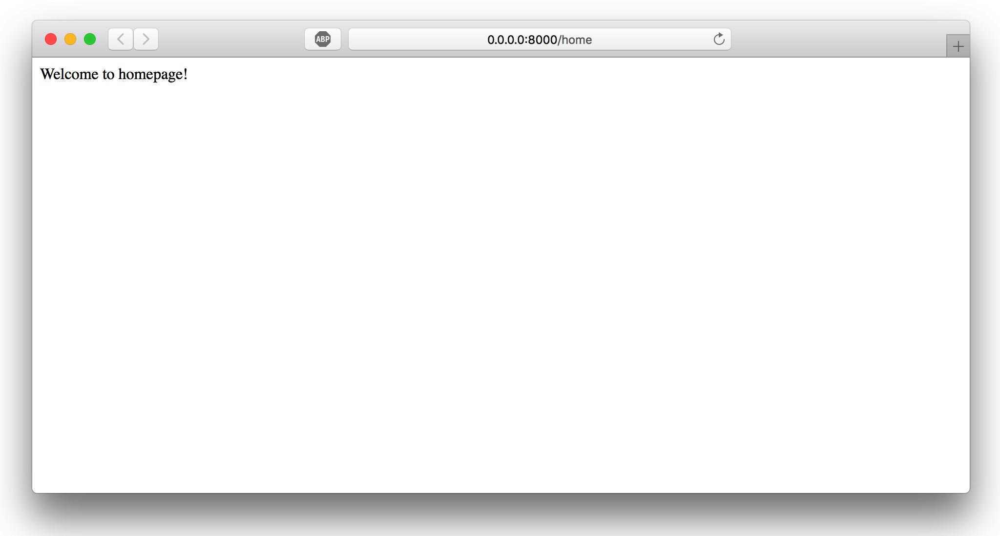

# 控制器

作为一种模仿 Sinatra 的极简框架，Pinatra 默认不提供 `Controller` 和 `Model` 基础组件，但都可以通过简单的 DIY 来实现。

下面我将展示如何在 Pinatra 框架中使用控制器。

## 路由中控制器的基本设计

Pinatra 路由提供了一个十分简易的 `Controller@method` 的调用方式，其背后就是如下简单的操作步骤：

1. 定义控制器的根命名空间，默认为 '\'，即根空间。
2. 拿到形如 `Controller@method` 的回调请求时，直接 new 对象，再调方法并传入参数。

```php
// 伪代码
$a = $baseNameSpace.$controller; // '\NameSpace\HomeController';
$b = $method; // 'home'
(new $a)->$method($a, $b, $c ...);
```

## 使用控制器

把控制器装入 Pinatra 需要三步。~~第一步，开冰箱门（不好意思窜台了）。~~

## 设置命名空间

设置命名空间的主要目的是为了自动加载，就是让我们不必再调用类之前先手动 require 文件。

PSR-4 规范是让命名空间默认和文件夹以及文件名的结构相同，最省事。PSR-0 规范允许每个文件内部随意设置，缺点是每次修改就要重新运行 `composer dump-autoload`。

Pinatra 推荐使用 PSR-4 自动加载规范，具体操作如下。

> 1. 新建和 public 文件夹同级的 controllers 文件夹
> 2. 修改 composer.json，增加以下内容：
> 
> ```json
> "autoload": {
>     "psr-4": {
>         "Controllers\\": "controllers/"
>     }
> },
> ```
> 
> 3. 运行命令 `composer dump-autoload`

## 让 Pinatra 知道

在 `public/index.php` 中增加一行代码：
```php
\Pinatra\Routing\Router::$baseNamespace = '\\Controllers\\';
```

## 尝试一下

### 创建控制器

创建 `controllers/HomeController.php` 文件，内容如下：

```php
<?php
namespace Controllers;

class HomeController
{
  public function home()
  {
    echo "Welcome to homepage!";
  }
}
```

### 创建路由

```php
get('home', 'HomeController@home');
```

### 检验成果

访问 `http://0.0.0.0:8000/home`，得到下图页面，成功！

