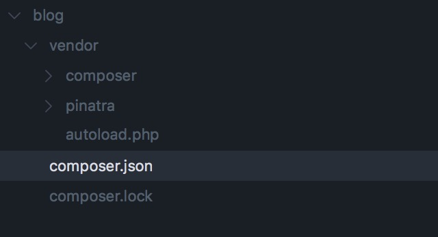
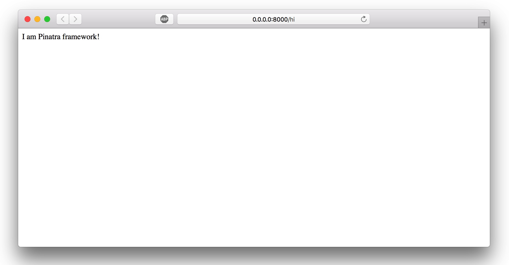

# 安装

## 环境要求

* PHP > 7.0
* Composer

### Composer

Composer 是最流行的 PHP 包管理器，各个社区中存在着海量的开源软件，供你选择。在此推荐一个[中国镜像](https://packagist.laravel-china.org)。

## 详细步骤

Pinatra 是第一个做到真正 hands-off 的 PHP 框架，其本身只作为一个库存在，却提供了复杂的路由功能和详尽的 MVC 结构。

下面是“一步一步跟我做”教程：

### 新建项目文件夹

```bash
mkdir blog
```

### composer 初始化

```bash
cd blog
composer self-update
composer init
```

之后一路回车，直到 `Search for a package`，输入 `pinatra/framework` 回车，出现 `Enter the version constraint to require (or leave blank to use the latest version)` 输入 `dev-master`，之后继续一路回车直到交互结束。

这时，执行 `ls -a` 出现下图所示即为成功：


### 查看 composer.json

此时 composer.json 的内容应该如下：

```json
{
    "name": "user/blog",
    "require": {
        "pinatra/framework": "dev-master"
    },
    "authors": [
        {
            "name": "JohnLui",
            "email": "user@gmail.com"
        }
    ]
}
```

### 下载所有 composer 包

执行命令：

```bash
composer update
```

此时你应该得到了 vendor 文件夹，将其展开应该如下图所示：



### 建立 index.php

网站的 document root 文件夹应该和 vendor 同级，这是一项安全要求。新建 public 文件夹：

```bash
mkdir public
cd public
```

新建 index.php 文件：

```bash
touch index.php
```

之后填入以下内容：

```bash
<?php

require __DIR__.'/../vendor/autoload.php';

get('hi', function() {
  echo "I am Pinatra framework!";
});
```

### 使用 PHP 自带的单线程 web server 让我们的网站跑起来！

确保此时命令行的当前路径在 public 文件夹下，之后运行如下命令：

```bash
php -S 0.0.0.0:8000
```

### 查看成果

访问 `http://0.0.0.0:8000/hi`，如果你的结果如下图所示，说明你成功了！

