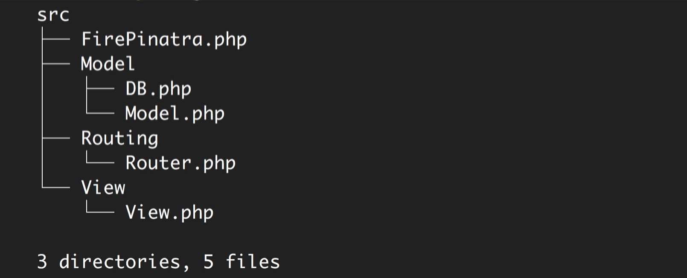

# 内核详解

站在 Composer 的肩膀上，0.0.2 版本的 Pinatra 只有 5 个 PHP 文件。

## 请求处理流程

## 关键点

* 使用 `register_shutdown_function('dispatch')` 来实现 hands-off
* 框架的核心是路由，路由代码必须千锤百炼（不用担心，它们经过了 100% 覆盖率的测试）
* 不引入模板引擎，View 的实现也非常简洁
* 感谢 Laravel 提供了极其强大的 ORM
* Composer 及开源社区赋予了 Pinatra 无穷的可能性，Pinatra 只需要做到尽量不侵入用户意图

## 不足

0.0.2 版本的 Pinatra 还有很多不足，下面列出的是已经计划开发的功能，欢迎告诉我你想增加的功能。

1. 日志功能
2. ...

## 帮助 Pinatra 改进

欢迎给 Pinatra 提 issue：[https://github.com/Pinatra/Pinatra/issues/new](https://github.com/Pinatra/Pinatra/issues/new)